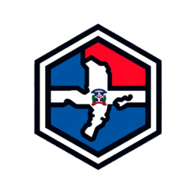
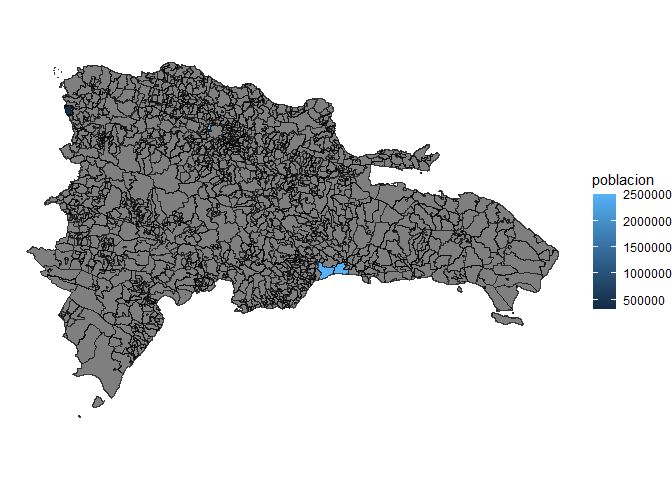
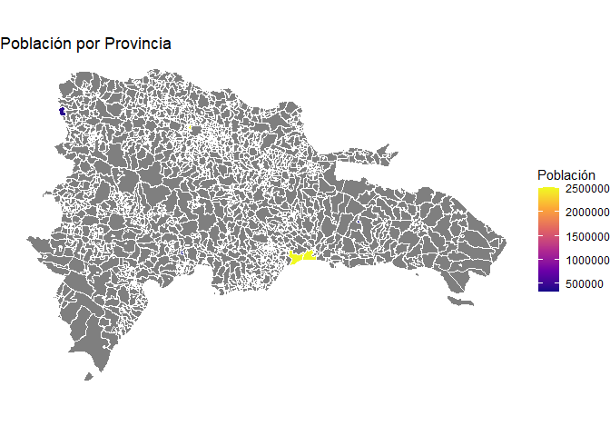

# geodom 

<!-- badges: start -->

[](https://github.com/GeoDOMProject/geodomR/actions/workflows/R-CMD-check.yaml)
<!-- badges: end -->

**geodom** proporciona acceso a un marco de datos geoespaciales
estandarizados para la República Dominicana. El paquete incluye
funciones para descargar y cargar eficientemente datos geográficos,
limpiar nombres de unidades administrativas, y crear mapas coropléticos
con detección automática del nivel geográfico.

## Instalación

Puedes instalar geodom desde GitHub:

``` r
# install.packages("pak")
pak::pak("dnldelarosa/geodomR")
```

## Uso Rápido

### Cargar datos geográficos

``` r
library(geodom)

# Provincias
provincias <- gd_provinces()

# Regiones de planificación
regiones <- gd_regions()

# Municipios
municipios <- gd_municipalities()

# Otros niveles: gd_dm(), gd_sections(), gd_bparajes(), gd_zones()
```

### Crear mapas con detección automática

La función `gd_map()` detecta automáticamente el nivel geográfico y la
mejor variable para colorear:

``` r
# Datos de ejemplo
datos <- data.frame(
    provincia = c("Santo Domingo", "Santiago", "La Vega", "Puerto Plata"),
    poblacion = c(2500000, 1000000, 400000, 320000)
)

# ¡Solo esto! Todo se detecta automáticamente
gd_map(datos)
#> Variable de fill detectada automáticamente: 'poblacion'
```



### Personalizar mapas

``` r
library(ggplot2)

gd_map(datos, fill = "poblacion", color = "white", linewidth = 0.3) +
    scale_fill_viridis_c(option = "plasma", name = "Población") +
    labs(title = "Población por Provincia")
```



### Limpiar nombres de provincias

``` r
# Acepta variaciones como minúsculas, sin tildes, abreviaciones
gd_clean_prov_name(c("santo domingo", "Elias Pina", "la vega"))
#> [1] "Santo Domingo" "Elías Piña"    "La Vega"
```

## Funciones Principales

| Función                        | Descripción                              |
|--------------------------------|------------------------------------------|
| `gd_provinces()`               | Límites de las 32 provincias             |
| `gd_regions()`                 | Regiones de planificación                |
| `gd_municipalities()`          | Los 158 municipios                       |
| `gd_dm()`                      | Distritos municipales                    |
| `gd_sections()`                | Secciones censales                       |
| `gd_bparajes()`                | Barrios y parajes                        |
| `gd_zones()`                   | Zonas de residencia (urbana/rural)       |
| `gd_map()`                     | Crear mapa coroplético con autodetección |
| `gd_detect_level()`            | Detectar nivel geográfico de datos       |
| `gd_clean_prov_name()`         | Limpiar nombres de provincias            |
| `gd_clean_region_name()`       | Limpiar nombres de regiones              |
| `gd_clean_municipality_name()` | Limpiar nombres de municipios            |
| `gd_clean_dm_name()`           | Limpiar nombres de distritos municipales |
| `gd_clean_section_name()`      | Limpiar nombres de secciones             |
| `gd_clean_bparaje_name()`      | Limpiar nombres de barrios/parajes       |
| `gd_clean_zone_name()`         | Limpiar nombres de zonas                 |

## Documentación

- [Sitio pkgdown](https://geodomproject.github.io/geodomR/)
- [Vignette: Funciones de
  Mapeo](https://geodomproject.github.io/geodomR/articles/mapeo.html)

## Sobre GeoDOM

**geodom** es parte de [GeoDOM](https://geodom.adatar.do), una
iniciativa de [Adatar](https://www.adatar.do) que busca ofrecer un
framework unificado para el análisis geoespacial de la República
Dominicana.

## Licencia

MIT
